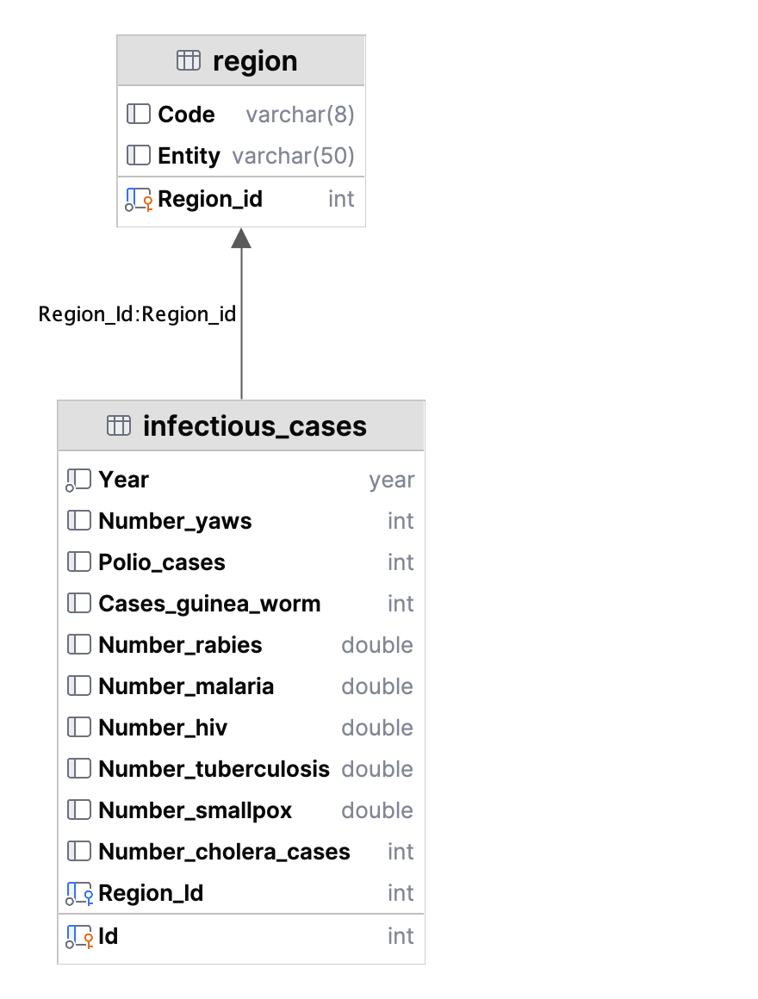

## 1. Створення БД та завантаження даних
[Seed](seed/infectious_cases.csv)

```sql
create table infectious_cases
(
    Id                   int       primary key auto_increment ,
    Entity               varchar(50) not null,
    Code                 varchar(10) null,
    Year                 YEAR        not null,
    Number_yaws          int         null,
    Polio_cases          int         null,
    Cases_guinea_worm    int         null,
    Number_rabies        real        null,
    Number_malaria       real        null,
    Number_hiv           real        null,
    Number_tuberculosis  real        null,
    Number_smallpox      real        null,
    Number_cholera_cases int         null
);
```

## 2. Нормалізація таблиці infectious_cases

```sql
CREATE TABLE region(
   Region_id int primary key auto_increment,
   Entity varchar(50),
   Code varchar(8)
) SELECT DISTINCT Code, Entity
  FROM infectious_cases;

ALTER TABLE infectious_cases
ADD COLUMN Region_Id int;

UPDATE infectious_cases
SET Region_Id = (SELECT Region_id
                 FROM region
                 WHERE infectious_cases.Entity = region.Entity
                   AND (infectious_cases.Code = region.Code or infectious_cases.Code is null)
                 LIMIT 1)
Where Region_Id is null;

ALTER TABLE infectious_cases
MODIFY COLUMN Region_Id int not null,
ADD CONSTRAINT infectious_cases_region
FOREIGN KEY infectious_cases(Region_Id)
REFERENCES region(Region_Id);

ALTER table infectious_cases
DROP COLUMN Entity,
DROP COLUMN Code;
```



## Завдання 3
> Для кожної унікальної комбінації Entity та Code або їх id порахуйте середнє, мінімальне,
> максимальне значення та суму для атрибута Number_rabies.
> Атрибут Number_rabies може містити порожні значення ‘’.
> - Результат відсортуйте за порахованим середнім значенням у порядку спадання.
> - Оберіть тільки 10 рядків.
```sql
    select Region_Id as region,
           max(Number_rabies) as max,
           min(Number_rabies) as min,
           avg(Number_rabies) as average,
           sum(Number_rabies) as sum
    from infectious_cases
    where Number_rabies is not null
    group by Region_Id
    order by average desc
    limit 10;
```

## Завдання 4-5
> Для оригінальної або нормованої таблиці для колонки Year побудуйте з використанням вбудованих SQL-функцій:
> - атрибут, що створює дату першого січня відповідного року,
> 💡 Наприклад, якщо атрибут містить значення ’1996’, то значення нового атрибута має бути ‘1996-01-01’.
> - атрибут, що дорівнює поточній даті,
> - атрибут, що дорівнює різниці в роках двох вищезгаданих колонок.

> Створіть і використайте функцію, що будує такий же атрибут, як і в попередньому завданні:
> функція має приймати на вхід значення року, а повертати різницю в роках між поточною датою
> та датою, створеною з атрибута року (1996 рік → ‘1996-01-01’).

### variant 1 select

```sql
select MAKEDATE(Year, 1) as startOfYear,
       CURRENT_DATE as lastUpdate,
       TIMESTAMPDIFF(YEAR, startOfYear, lastUpdate) as dateDiff
from infectious_cases;
```


### variant 2 create new columns
```sql
alter table infectious_cases
#Expression of generated column 'currentDate' contains a disallowed function: curdate.
add column lastUpdate date DEFAULT (CURRENT_DATE) not null,
add column startOfYear date as (MAKEDATE(Year, 1)),
add column dateDiff int as (TIMESTAMPDIFF(YEAR, startOfYear, lastUpdate));

select startOfYear, lastUpdate, dateDiff from infectious_cases;
```


### variant 3 function
```sql
drop function if exists datePassed;

Delimiter //
create function datePassed(Year year)
returns int
no sql
not deterministic
begin
    return (TIMESTAMPDIFF(YEAR, MAKEDATE(Year, 1), CURRENT_DATE));
end //
Delimiter ;

select
    MAKEDATE(Year, 1) as startOfYear,
    CURRENT_DATE as lastUpdate,
    datePassed(Year) as dateDiff
from infectious_cases;
```

## Завдання Additional
> Побудуйте функцію, що рахує кількість захворювань за певний період.
> Для цього треба поділити кількість захворювань на рік на певне число:
> 12 — для отримання середньої кількості захворювань на місяць,
> 4 — на квартал, 2 — на півріччя.
> Функція буде приймати два параметри: кількість захворювань на рік та довільний дільник.

```sql
drop function if exists perPeriod;

Delimiter //
create function perPeriod(amount float, period ENUM('місяць','квартал','півріччя'))
    returns float
    no sql
    deterministic
begin
    RETURN CASE
        WHEN period = 'місяць' THEN amount/12
        WHEN period = 'квартал' THEN amount/4
        WHEN period = 'півріччя' THEN amount/2
        ELSE amount
    END;
end //
Delimiter ;

select Region_Id as region,
       Year,
       perPeriod(Number_yaws, 'місяць') as 'місяць',
       perPeriod(Number_yaws, 'квартал') as 'квартал',
       perPeriod(Number_yaws, 'півріччя') as 'півріччя'
from infectious_cases
where Number_yaws is not null and Number_yaws != 0;
```

> Врахуйте, що атрибут Number_rabies може містити порожні значення ‘’ — вам попередньо необхідно їх відфільтрувати.
> Number_rabies має тип double і не може мати значення пустого рядку
